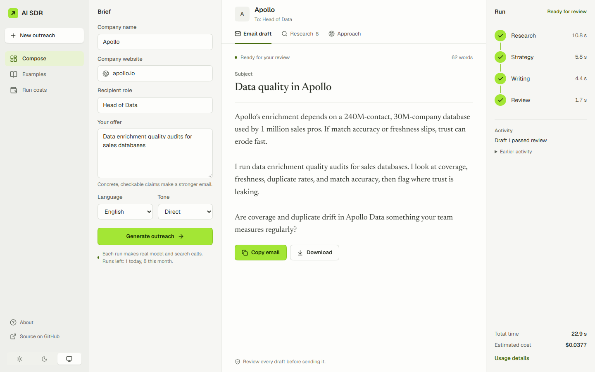
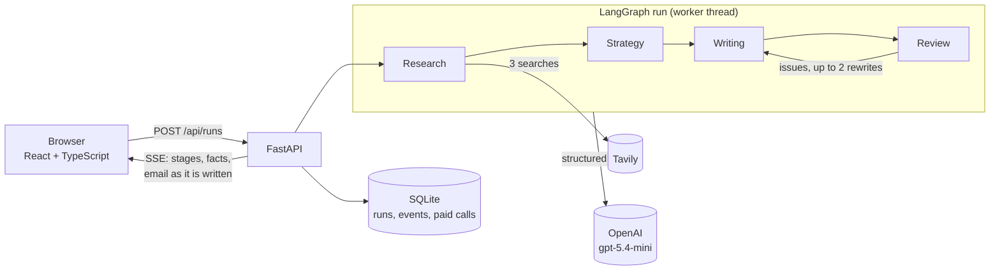
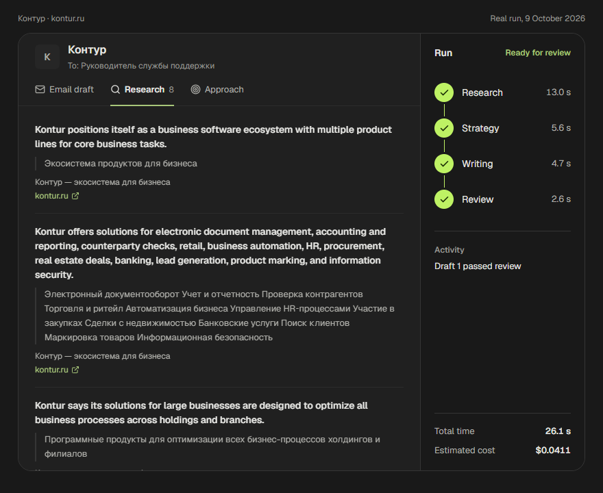

# AI SDR

[](https://github.com/trigonosaurus-rgb/ai-sdr-langgraph/actions/workflows/ci.yml)

A web app that researches a company and drafts a personalized cold email, with every claim traced to a quote on a real web page. You give the company, its website, your offer, the recipient's role, the language (English or Russian) and the tone. In about 25 seconds and for about 4 cents you get the facts with their sources, the reasoning behind the approach, and a reviewed draft to edit. Nothing is sent for you.

<picture>
  <source media="(prefers-color-scheme: dark)" srcset="docs/screenshot-dark.png">
  
</picture>

<sub>A real run, not a mock-up: 8 facts from apollo.io, the draft passed review on the first attempt, 22.9 s, $0.0377 including web search.</sub>

## Why it is built this way

Generic AI outreach invents things: a funding round that did not happen, a product the company does not make, a pain point stated as fact. This app is designed so that a reader can check every claim before sending, and so that it says "not enough data" instead of guessing.

- **Facts must be quoted.** Research extracts facts with structured output, and a fact is kept only if its quote appears verbatim on the cited page. The check normalizes typography (guillemets, non-breaking hyphens, ё), so Russian sources are not rejected for punctuation.
- **It refuses honestly.** If the search results describe a different company than the given website (Stripe with adyen.com as its site), or there is too little to write something specific, the run stops with that reason. An offer that does not fit the company is flagged, not dressed up.
- **Guesses are labelled.** The approach separates the observation (from facts) from hypotheses about the recipient's needs, and the email does not state them as facts.
- **Outcomes are honest.** A run ends `ready`, `needs_attention` (a draft exists but did not pass review after the allowed rewrites, or the fit is poor) or `failed`. A model or parsing error never becomes a draft and never counts as a passed review.

## How it works



1. **Research** runs three Tavily searches (the official site, the open web, recent news), names the owner of the website, and keeps only quoted facts.
2. **Strategy** picks one observation grounded in the facts, links it to the offer, lists assumptions as hypotheses and judges the fit.
3. **Writing** drafts the subject and body in the chosen language and tone, streamed token by token. A rewrite sees the previous draft and the review's issues.
4. **Review** checks grounding, language, tone, spamminess and placeholders, and blocks only real problems.

Prompts live in versioned files under [`prompts/`](prompts/); every result records the prompt versions and the token usage reported by the API.



<sub>The Research tab of a real run in Russian: each fact with its verbatim quote and a link to the page. The app's Examples page replays this run and the Apollo one.</sub>

## Engineering decisions

- **Streaming that survives a reload.** Every event is stored in SQLite with a sequence number before it is sent. The browser follows a run over SSE and resumes with `Last-Event-ID`; after a reload it rebuilds the view by replaying the run's events. Runs can be cancelled; cancellation is checked before each paid call, so a call already in flight is finished and counted.
- **Costs are recorded, not estimated afterwards.** Each OpenAI and Tavily call is stored the moment it ends, failed ones included, with its tokens (cached input and reasoning as subsets, never counted twice) and its price from a dated price table. Prices are never recalculated retroactively. Unknown usage is shown as a dash, not zero.
- **Open to the public without accounts.** Each visitor address gets 3 runs a day and 10 a month, one at a time, stored only as a salted hash. A monthly budget for the whole service (model dollars and search credits) is checked before every paid call; when it runs out, the app says the service is paused instead of failing midway.
- **Measured, not tuned by feel.** Model and prompt changes are compared on 28 briefs with search results recorded once and replayed, 8 of them held out until the end, plus a blind human check of the automatic grades (below).
- **Small attack surface.** Provider keys stay on the server. The page is served with a `'self'`-only Content Security Policy, and source URLs from search become links only if they are `http(s)`.
- **Tested without paying.** 116 pytest tests and 39 Vitest tests run on fake models and search; 13 Playwright tests drive the real API on a scripted graph in Edge. CI runs them all, plus a smoke test of the Docker image, on every push.

## Measured quality and model choice

Measured on 28 briefs in [`evals/`](evals/README.md): well-known and small companies, ambiguous names, fictional companies, a website that belongs to someone else, an offer that does not fit, English and Russian. 8 briefs are held out from tuning. Search results are recorded once and replayed, so every configuration sees the same pages. Each configuration ran every development brief twice.

| Configuration (prompts v2) | Outcome as expected | Successful runs | Model cost per success | Median time |
| --- | --- | --- | --- | --- |
| `gpt-5.4-mini`, prompts v1 (baseline) | 34/40 | 24/40 | $0.021 | 16 s |
| **`gpt-5.4-mini`** | **40/40** | **37/40** | $0.013 | **14 s** |
| `gpt-6-luna` | 40/40 | 32/40 | $0.0015 | 19 s |
| `gpt-6.1-sol` | 40/40 | 35/40 | $0.023 | 30 s |
| luna research, sol strategy, mini writing and review | 40/40 | 35/40 | $0.010 | 20 s |
| **`gpt-5.4-mini`, held-out briefs** | **16/16** | **13/16** | $0.015 | 16 s |

- **Outcome as expected**: a draft where one is warranted, a refusal for a wrong website or too little information, a poor-fit warning for an unrelated offer. Checked automatically.
- **Successful**: the outcome is right and, for a draft, it is fully grounded and scores at least 5 of 6 on grounding, relevance and naturalness. Drafts were graded by Claude (Anthropic): a different vendor from the models under test, but still an LLM, and it knew which configuration it was grading.
- **Blind human check**: the author graded 26 drafts with the configuration hidden. On grounding the grades matched Claude's 25 times out of 26; Claude was more generous on relevance (+0.31 on a 0–2 scale) and naturalness (+0.35), so naturalness scores above are optimistic. The human grades also ranked `gpt-5.4-mini` with prompts v2 first.
- **Cost** is the model only, from list prices. Search adds $0.024 per run (3 Tavily credits at the pay-as-you-go rate), more than the model for every configuration except sol.

The biggest gain came from fixes, not from a bigger model: the quote check had rejected Russian quotes in guillemets, the website check asked an ambiguous question and accepted a competitor's site, and the review blocked drafts over style. `gpt-5.4-mini` stays on every stage: best results, fastest, one model.

## Run it yourself

### Setup

```powershell
python -m venv .venv
.venv\Scripts\python.exe -m pip install -r requirements-dev.txt
```

`requirements.txt` and `requirements-dev.txt` are pinned lock files compiled with pip-tools from `requirements.in` and `requirements-dev.in`.

Copy [`.env.example`](.env.example) to `.env` in the repository root and fill in the OpenAI and Tavily keys and a random `SDR_CLIENT_SALT` (the API refuses to start without it: an unsalted hash of an IPv4 address can be reversed by trying them all). Everything else is optional; the file lists the defaults.

### Run

In the browser (API on :8000, Vite on :5173). Generate makes paid OpenAI and Tavily calls:

```powershell
cd frontend
npm.cmd ci
npm.cmd run dev:all
```

From the terminal, also paid:

```powershell
.venv\Scripts\python.exe -m core.cli --company "Acme" --website acme.com `
  --offer "Contract data engineers for analytics teams" --recipient "VP of Engineering" `
  --language English --tone Direct
```

Progress goes to stderr, the draft to stdout, and the full result with facts, attempts, prompt versions and usage to `runs/<run_id>.json`.

In Docker: one image serves the API under `/api` and the built frontend at `/`. The database lives on the `/data` volume; configuration comes from the environment, the `.env` file is never copied into the image.

```powershell
docker build -t ai-sdr .
docker run -p 8000:8000 --env-file .env -v ai-sdr-data:/data ai-sdr   # Generate is paid here too
```

Behind a reverse proxy, set `FORWARDED_ALLOW_IPS` to the proxy's address, or every visitor looks like the proxy and shares one quota. Run a single instance: runs in progress live in the server's memory.

### Tests

```powershell
.venv\Scripts\python.exe -m pytest     # fake LLM and search, no network
cd frontend; npm.cmd test; npm.cmd run test:browser   # Vitest; Playwright on a fake API
```

GitHub Actions runs all of them, the build and a smoke test of the Docker image on every push, without provider keys.

### Project layout

- [`core/`](core/) — the graph, structured output, search, pricing and the run context that logs every paid call.
- [`agents/`](agents/) and [`prompts/`](prompts/) — the four graph nodes and their versioned prompts.
- [`server/`](server/) — FastAPI, the run manager (threads, cancellation, quotas, budget) and SQLite storage.
- [`frontend/`](frontend/README.md) — React 19, TypeScript and Vite; the API contract is in [`frontend/INTEGRATION.md`](frontend/INTEGRATION.md).
- [`evals/`](evals/README.md) — the evaluation set, search snapshots, automatic checks and grades.
- [ROADMAP.md](ROADMAP.md) — the plan, decisions and results by stage.

Not included by design: sending email, a CRM, accounts and payments.
